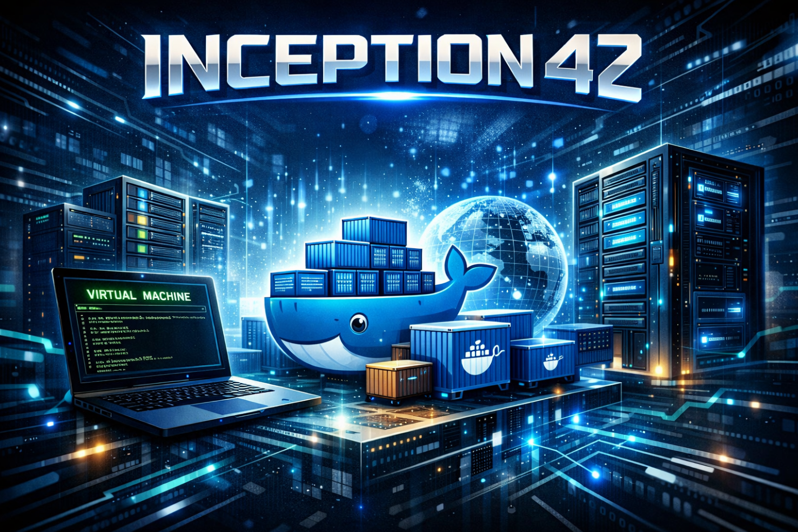

# 🐳 Inception - System Administration with Docker

<div align="center">



**A 42 Beirut project focused on mastering Docker containerization and system administration**

[](https://42beirut.com/)
[](https://www.docker.com/)
[](https://nginx.org/)
[](https://wordpress.org/)
[](https://mariadb.org/)

</div>

---

## 📋 Table of Contents

- [About](#-about)
- [Project Overview](#-project-overview)
- [Architecture](#-architecture)
- [Technologies Used](#-technologies-used)
- [Features](#-features)
- [Prerequisites](#-prerequisites)
- [Installation](#-installation)
- [Usage](#-usage)
- [Project Structure](#-project-structure)
- [Configuration](#-configuration)
- [Docker Services](#-docker-services)
- [Security Considerations](#-security-considerations)
- [Troubleshooting](#-troubleshooting)
- [Author](#-author)

---

## 🎯 About

**Inception** is a comprehensive system administration project from the 42 curriculum that challenges you to build a complete web infrastructure using Docker containers. This project emphasizes understanding containerization, networking, security, and orchestration without relying on pre-built images.

The goal is to set up a small infrastructure composed of different services following specific rules, including building your own Docker images and configuring each service manually.

---

## 🌟 Project Overview

This project implements a **fully containerized WordPress website** with the following components:

- **NGINX** web server with TLSv1.2/TLSv1.3 SSL encryption
- **WordPress** CMS with PHP-FPM
- **MariaDB** database server
- Custom Docker images built from **Alpine Linux 3.22**
- Automated setup with Docker Compose
- Persistent data storage using Docker volumes
- Isolated network environment

### Key Objectives

✅ Build custom Docker images from scratch (no ready-made images)  
✅ Implement secure HTTPS communication with self-signed SSL certificates  
✅ Configure inter-container communication via Docker networks  
✅ Set up persistent data volumes for database and WordPress files  
✅ Use environment variables for sensitive configuration  
✅ Implement proper container orchestration with Docker Compose  
✅ Follow best practices for security and performance  

---

## 🏗️ Architecture

The infrastructure consists of three interconnected Docker containers:

```
┌─────────────────────────────────────────────────────┐
│                   Host Machine                      │
│                                                     │
│  ┌────────────────────────────────────────────┐     │
│  │         Docker Network (Bridge)            │     │
│  │                                            │     │
│  │  ┌──────────┐      ┌──────────┐            │     │
│  │  │  NGINX   │──────│WordPress │            │     │
│  │  │  :443    │      │  :9000   │            │     │
│  │  └──────────┘      └──────────┘            │     │
│  │       │                  │                 │     │
│  │       │            ┌──────────┐            │     │
│  │       └────────────│ MariaDB  │            │     │
│  │                    │  :3306   │            │     │
│  │                    └──────────┘            │     │
│  └────────────────────────────────────────────┘     │
│                                                     │
│  Volumes:                                           │
│  	/home/user/data/wordpress                         │
│  	/home/user/data/mariadb                           │
└─────────────────────────────────────────────────────┘
```

### Communication Flow

1. **Client → NGINX (Port 443)**: HTTPS requests arrive at NGINX
2. **NGINX → WordPress (Port 9000)**: PHP requests forwarded via FastCGI
3. **WordPress → MariaDB (Port 3306)**: Database queries over internal network
4. **All services** communicate through an isolated Docker bridge network

---

## 🛠️ Technologies Used

<div align="center">


</div>

### Core Technologies

| Technology | Version | Purpose |
|------------|---------|---------|
| **Alpine Linux** | 3.22 | Lightweight base image for all containers |
| **Docker** | Latest | Container runtime and orchestration |
| **Docker Compose** | Latest | Multi-container application management |
| **NGINX** | Latest | Reverse proxy and SSL termination |
| **PHP-FPM** | 8.3 | PHP FastCGI Process Manager |
| **WordPress** | Latest | Content Management System |
| **MariaDB** | Latest | Relational database server |
| **WP-CLI** | Latest | WordPress command-line interface |
| **OpenSSL** | Latest | SSL certificate generation |

### Development Tools

- **Bash Scripting**: Automated container initialization
- **Makefile**: Build automation and project management
- **Environment Variables**: Secure configuration management

---

## ✨ Features

### 🔒 Security
- **TLS 1.2/1.3 encryption** for all HTTPS traffic
- **Self-signed SSL certificates** generated at build time
- **Environment-based secrets** management
- **Isolated container network** preventing unauthorized access
- **Non-root user execution** for PHP-FPM processes

### 🚀 Performance
- **Alpine Linux base** for minimal image sizes
- **PHP-FPM optimization** for WordPress
- **Persistent volumes** for fast data access
- **Efficient networking** with Docker bridge driver

### 🔧 Automation
- **Automated MariaDB initialization** with custom SQL scripts
- **WordPress auto-installation** via WP-CLI
- **Automated user creation** for WordPress
- **Health checks** and dependency management
- **One-command deployment** via Makefile

### 📦 Modularity
- **Custom-built images** from scratch
- **Separate Dockerfiles** for each service
- **Configuration files** mounted at runtime
- **Easy customization** through environment variables

---

## 📦 Prerequisites

Before running this project, ensure you have the following installed:

- **Docker Engine** (v20.10 or higher)
- **Docker Compose** (v2.0 or higher)
- **Make** (GNU Make)
- **Linux/Unix environment** (WSL2 for Windows users)
- **Sudo privileges** for volume management

### Installation Check

```bash
# Check Docker
docker --version

# Check Docker Compose
docker-compose --version

# Check Make
make --version
```

---

## 🚀 Installation

### 1. Clone the Repository

```bash
git clone <your-repo-url>
cd inception
```

### 2. Configure Environment Variables

Copy the example environment file and customize it:

```bash
cp srcs/.env.example srcs/.env
```

Edit `srcs/.env` with your configuration:

```env
# Domain Configuration
DOMAIN_NAME=your_login.42.fr

# SSL Certificates Path
CERTS=/etc/ssl

# MariaDB Configuration
DB_HOST=mariadb
DB_PORT=3306
DB_USER_NAME=your_db_user
DB_USER_PW=your_db_password
DB_ROOT_PW=your_db_root_password

# WordPress User Configuration
WP_USER_NAME=your_wp_user
WP_USER_PW=your_wp_user_password
WP_USER_MAIL=user@your_domain.42.fr

# WordPress Admin Configuration
WP_ADMIN_NAME=your_admin_name
WP_ADMIN_PW=your_admin_password
WP_ADMIN_MAIL=admin@your_domain.42.fr
```

### 3. Update Makefile (if needed)

Modify the `USER` variable in the Makefile to match your system username:

```makefile
USER := your_username
```

### 4. Add Domain to Hosts File

Add your domain to `/etc/hosts`:

```bash
echo "127.0.0.1 your_login.42.fr" | sudo tee -a /etc/hosts
```

---

## 💻 Usage

### Build and Start Services

```bash
# Build images and start all containers
make all
```

This command will:
- Create data directories for persistent storage
- Build Docker images for NGINX, WordPress, and MariaDB
- Start all containers in detached mode
- Initialize the database and WordPress installation

### Other Commands

```bash
# Start containers without rebuilding
make up

# Stop all containers
make clean

# Stop containers and remove all data
make fclean

# Remove all Docker resources (containers, images, volumes)
make prune

# View container logs
docker-compose -f srcs/docker-compose.yml logs -f

# Check container status
docker ps
```

### Access Your WordPress Site

Once the containers are running, access your site at:

```
https://your_login.42.fr
```

**Note**: You'll see a browser warning about the self-signed certificate. This is expected—click "Advanced" and proceed.

---

## 📂 Project Structure

```
inception/
├── Makefile                          # Build automation
├── srcs/
│   ├── .env                         # Environment variables (gitignored)
│   ├── .env.example                 # Environment template
│   ├── docker-compose.yml           # Container orchestration
│   └── requirements/
│       ├── mariadb/
│       │   ├── Dockerfile           # MariaDB image definition
│       │   ├── conf/
│       │   │   └── db.sql          # Database initialization
│       │   └── tools/
│       │       └── entrypoint.sh   # Container startup script
│       ├── nginx/
│       │   ├── Dockerfile           # NGINX image definition
│       │   └── conf/
│       │       └── nginx.conf      # Web server configuration
│       └── wordpress/
│           ├── Dockerfile           # WordPress image definition
│           ├── conf/
│           │   └── wordpress.conf  # PHP-FPM configuration
│           └── tools/
│               └── entrypoint.sh   # WordPress setup script
└── README.md                        # This file
```

---

## ⚙️ Configuration

### Docker Compose Configuration

The `docker-compose.yml` file orchestrates three services:

#### Networks
- **itawi_network**: Isolated bridge network for inter-container communication

#### Volumes
- **mariadb**: Persistent database storage (`/home/user/data/mariadb`)
- **wordpress**: Persistent WordPress files (`/home/user/data/wordpress`)

#### Services
1. **MariaDB**: Database backend with volume persistence
2. **WordPress**: PHP-FPM application server depending on MariaDB
3. **NGINX**: Web server and reverse proxy exposing port 443

### Environment Variables

All sensitive configuration is managed through the `.env` file:

| Variable | Description | Example |
|----------|-------------|---------|
| `DOMAIN_NAME` | Your domain name | `user.42.fr` |
| `CERTS` | SSL certificate path | `/etc/ssl` |
| `DB_HOST` | Database hostname | `mariadb` |
| `DB_PORT` | Database port | `3306` |
| `DB_USER_NAME` | Database username | `wpuser` |
| `DB_USER_PW` | Database password | `secure_pass` |
| `DB_ROOT_PW` | Database root password | `root_pass` |
| `WP_USER_NAME` | WordPress user | `editor` |
| `WP_USER_PW` | WordPress user password | `user_pass` |
| `WP_USER_MAIL` | WordPress user email | `user@domain.fr` |
| `WP_ADMIN_NAME` | WordPress admin | `admin` |
| `WP_ADMIN_PW` | WordPress admin password | `admin_pass` |
| `WP_ADMIN_MAIL` | WordPress admin email | `admin@domain.fr` |

---

## 🐋 Docker Services

### NGINX Container

**Purpose**: Reverse proxy with SSL/TLS termination

**Key Features**:
- Self-signed SSL certificate generation with OpenSSL
- TLSv1.2 and TLSv1.3 support
- FastCGI proxy to WordPress PHP-FPM
- Static file serving for WordPress assets

**Exposed Ports**: 443 (HTTPS)

### WordPress Container

**Purpose**: PHP-FPM application server running WordPress

**Key Features**:
- WordPress installation via WP-CLI
- Automatic admin and user creation
- PHP 8.3 with essential extensions
- MySQL connectivity for MariaDB
- Configuration for FastCGI communication

**Exposed Ports**: 9000 (PHP-FPM)

### MariaDB Container

**Purpose**: Relational database backend

**Key Features**:
- Remote connection support
- Custom database initialization with SQL scripts
- User and permission management
- Data persistence through volumes

**Exposed Ports**: 3306 (MySQL protocol)

---

## 🔐 Security Considerations

### SSL/TLS Configuration
- ✅ Self-signed certificates generated at build time
- ✅ Forced TLSv1.2 and TLSv1.3 protocols
- ✅ Automatic certificate renewal not required (development environment)

### Database Security
- ✅ Non-root database user with limited privileges
- ✅ Strong password enforcement via environment variables
- ✅ Database accessible only within Docker network

### Container Isolation
- ✅ Each service runs in its own isolated container
- ✅ Private bridge network prevents external access
- ✅ Only port 443 exposed to host machine

### Best Practices
- ⚠️ Change default passwords in `.env` file
- ⚠️ Use strong, unique passwords for production
- ⚠️ Keep `.env` file out of version control
- ⚠️ Regularly update base images for security patches

---

## 🐛 Troubleshooting

### Common Issues

#### 1. Port Already in Use

```bash
Error: bind: address already in use
```

**Solution**: Stop services using port 443
```bash
sudo lsof -i :443
sudo kill -9 <PID>
```

#### 2. Permission Denied on Volumes

```bash
Error: permission denied
```

**Solution**: Ensure proper ownership
```bash
sudo chown -R $USER:$USER /home/$USER/data
```

#### 3. Container Won't Start

```bash
# Check container logs
docker-compose -f srcs/docker-compose.yml logs mariadb
docker-compose -f srcs/docker-compose.yml logs wordpress
docker-compose -f srcs/docker-compose.yml logs nginx
```

#### 4. Database Connection Failed

**Check**:
- MariaDB container is running: `docker ps`
- Environment variables are correctly set in `.env`
- Network connectivity: `docker network inspect srcs_itawi_network`

#### 5. SSL Certificate Errors

**Solution**: Regenerate certificates
```bash
make fclean
make all
```

### Debug Commands

```bash
# Enter a running container
docker exec -it nginx sh
docker exec -it wordpress sh
docker exec -it mariadb sh

# Check container resource usage
docker stats

# Inspect network configuration
docker network inspect srcs_itawi_network

# View real-time logs
docker-compose -f srcs/docker-compose.yml logs -f --tail=100
```

---

## 👤 Author

**Ali Itawi**

- 42 Intra: `ali-itawi`
- Project: Inception
- School: 42 Beirut

---

## 📚 Resources

- [Docker Documentation](https://docs.docker.com/)
- [Docker Compose Documentation](https://docs.docker.com/compose/)
- [NGINX Documentation](https://nginx.org/en/docs/)
- [WordPress Documentation](https://wordpress.org/documentation/)
- [MariaDB Documentation](https://mariadb.org/documentation/)
- [Alpine Linux Documentation](https://wiki.alpinelinux.org/)
- [WP-CLI Documentation](https://wp-cli.org/)

---

## 📝 License

This project is part of the 42 School curriculum and follows the school's academic policies.

---

<div align="center">

**Made with ❤️ at 42 Beirut**

[](https://42.fr/)

</div>
